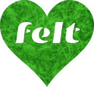

# [Felt.social](https://felt.social)

[](https://felt.social)

> customizable communities that feel good 💚 work in progress

[Felt.social](https://felt.social)
is a community, service, and business
powered by [Felt](https://github.com/feltcoop/felt),
a set of free and open source tools for building
customizable self-governing communities.

Felt seeks to empower us,
help us organize,
and improve our communication —
[Felt.social](https://felt.social) continues this mission
by developing a sustainable business to
support communities that are effective, authentic, and humane.

Our business is owned by a worker co-op
and we're working to become
a [platform co-op](https://platform.coop)
to best serve all stakeholders.
We feel like accountability is pretty cool.
If you think so too, we hope you'll join us!

Here's how to [learn about Felt](https://www.felt.social/about)
and its [source code](https://github.com/feltcoop/felt).

### develop

```bash
npm i
npm run dev
```

### build

```bash
npm run build
npm start
```

# :turtle:<sub>:turtle:</sub><sub><sub>:turtle:</sub></sub>

[Svelte](https://github.com/sveltejs/svelte) ∙
[SvelteKit](https://github.com/sveltejs/kit) ∙
[Vite](https://github.com/vitejs/vite) ∙
[Rollup](https://github.com/rollup/rollup) ∙
[TypeScript](https://github.com/microsoft/TypeScript) ∙
[Prettier](https://github.com/prettier/prettier)
& [more](package.json)

## License

[MIT](LICENSE)
