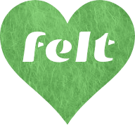

# [Felt.social](https://felt.social)

> customizable communities that feel good 💚

[Felt.social](https://felt.social)
is a community, service, and business
powered by [Felt](https://github.com/feltcoop/felt),
a set of free and open source tools for building
customizable self-governing communities.
Felt seeks to empower us,
help us organize,
and improve our communication —
[Felt.social](https://felt.social) continues this mission
by developing a sustainable business to
foster communities that are effective, authentic, and humane.
Our business is owned by a worker co-op
and one day we hope to become
a [platform co-op](https://platform.coop)
to best serve all stakeholders.
We feel like accountability is pretty cool.
If you think so too, we hope you'll join us!

- learn [about Felt](https://felt.dev/about) and check out its
  [source code](https://github.com/feltcoop/felt)
- sign up for our mailing list at our
  **work in progress** [Felt.social](https://felt.social)

## License

[MIT](LICENSE)
